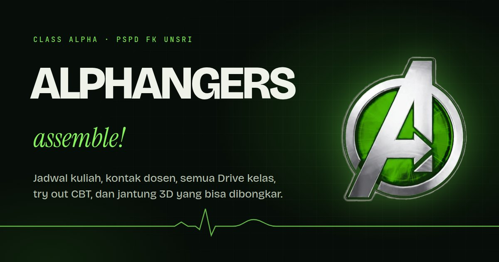

# Alphangers

Class portal for **Class Alpha**, Program Studi Pendidikan Dokter, Fakultas Kedokteran Universitas Sriwijaya (angkatan 2026).

> Portal kelas Alpha: jadwal kuliah hari ini, kontak dosen, semua Drive kelas, try out CBT, dan model jantung 3D yang bisa dibongkar. Panduan admin dan setup Firebase ada di [`docs/`](docs/) dalam Bahasa Indonesia.



## What it does

| Section | What a student gets |
| --- | --- |
| **Jadwal** | Today's sessions with time, room, lecturer and phone, a week strip and month calendar for any past or future date, what is on now and next, a countdown to the next exam, search across every session, and export to Google Calendar or `.ics`. All times are Palembang time (WIB) whatever the device clock says. |
| **Drive** | The ten class channels (Drive folders and the CBT try out) from v3, unchanged in behaviour. |
| **Dosen** | 476 lecturers with specialty, block codes, call, WhatsApp and copy buttons, filters by block and specialty, an A to Z index, and each lecturer's sessions in this class. |
| **Siklus jantung** | The scroll-driven heartbeat and ECG walkthrough from v3. |
| **Jantung 3D** | An original 3D heart with 55 clickable parts (chambers, great vessels, coronary arteries and cardiac veins, valves, chordae and papillary muscles, the conduction system). Each part has anatomy, function, key numbers, blood supply, clinical notes and its ECG link. Four views: whole, cut (frontal, four chamber, valve plane), electrical (a depolarisation wave synced to a live ECG trace) and blood flow (particles along the real routes, faster in systole). |
| **Search** | `Ctrl K` / `⌘ K` / `/` searches sessions, lecturers, channels and heart parts at once, and accepts Indonesian or English spelling (`genetik` finds "Genetic"). |
| **Pengumuman** | Announcements posted from the admin editor, with deadlines and countdowns. Hidden when there is nothing current. |
| **Offline** | Installable as an app. After one visit the schedule, lecturer list and heart still open without signal. |

Everything is editable without touching code through `/admin/`, a Google sign-in editor backed by Firestore (see [docs/ADMIN.md](docs/ADMIN.md)). Until Firebase is configured, the site runs entirely from the JSON in this repository and makes no third-party requests.

## Stack

- **Vite 8**, vanilla ES modules, no framework. Each section is its own lazily loaded module.
- **three.js** for the heart explorer, with a custom `MeshPhysicalMaterial` shader patch for per-part colour, highlighting, x-ray, the depolarisation wave and cut faces. Picking renders part ids into an 11×11 target around the pointer and takes the nearest hit, so thin structures such as the conduction fibres and chordae are easy to tap.
- **Python** (NumPy, SciPy, scikit-image, trimesh, fast-simplification) to sculpt the heart as signed distance fields, mesh it, label every vertex with its part, bake ambient occlusion and activation times, then **glTF Transform + meshoptimizer** to pack it (908 KB).
- **Firebase** Auth + Firestore for the admin, read by the portal over plain REST (no SDK on the public page).
- **Playwright** and `node:test` for tests; **Netlify** for hosting, with a strict Content Security Policy.

## Getting started

```bash
npm install
npm run dev          # http://127.0.0.1:5173
npm run build        # production build in dist/
npm run preview      # serve dist/
```

Node 20 or newer. Python 3.11+ is only needed to rebuild data or the heart model.

## Scripts

| Command | Does |
| --- | --- |
| `npm test` | Unit tests: schedule model, validator, content layer |
| `npm run test:e2e` | Builds, then runs the browser suites: portal (6 viewports, reduced motion, storage blocked, no WebGL, axe), schedule and lecturers, admin |
| `npm run test:rules` | Firestore security rules against the emulator (needs Java 21) |
| `npm run data` | Rebuilds `src/data/schedule.json` from the checked transcripts in `content/jadwal/`, and `dosen.json` when given the lecturer sheet (`npm run data -- path/to/kontak-dosen.xlsx`; the sheet itself is not in the repo) |
| `npm run heart` | Rebuilds the heart model from `scripts/heart/` into `public/models/` |

## Repository map

```
index.html              portal page
admin/                  admin editor page
src/main.js             portal entry: mounts sections as they come near
src/legacy/             the v3 shell (hero, loader, channels, try out, heartbeat section)
src/features/           jadwal, dosen, anatomi (3D heart), info (announcements), find (search)
src/lib/                content layer, validator, schedule model, calendar export
src/admin/              admin editor modules
src/data/               bundled content (the fallback for everything)
content/                cleaned schedule text and the try out question bank
scripts/heart/          the heart model pipeline
public/                 static files: model, icons, service worker, manifest
tests/                  unit, browser and rules tests
docs/                   architecture, security, admin and Firebase guides
```

## Documentation

- [docs/ARCHITECTURE.md](docs/ARCHITECTURE.md): how the page is put together, the content layer, the heart pipeline and renderer.
- [docs/SECURITY.md](docs/SECURITY.md): threat model, headers, Firestore rules, privacy.
- [docs/ADMIN.md](docs/ADMIN.md): using the editor (Bahasa Indonesia).
- [docs/FIREBASE_SETUP.md](docs/FIREBASE_SETUP.md): connecting Firebase, step by step (Bahasa Indonesia).

## Medical content

The heart notes are a study summary written for first-year medical students and checked against standard anatomy and physiology texts and open clinical references. They are not a substitute for the block's lecture slides and textbooks, and the site says so under every part.

## License

Copyright © 2026 Khalid (Resvet). All rights reserved. See [LICENSE](LICENSE). Third-party software keeps its own license; see [NOTICE](NOTICE).
